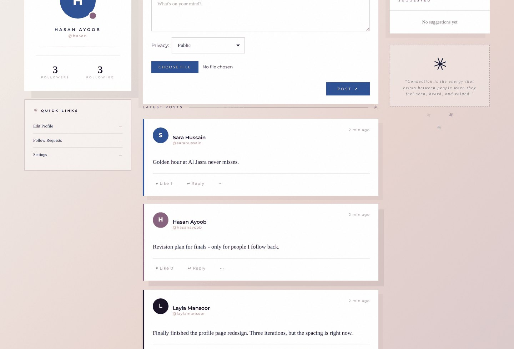
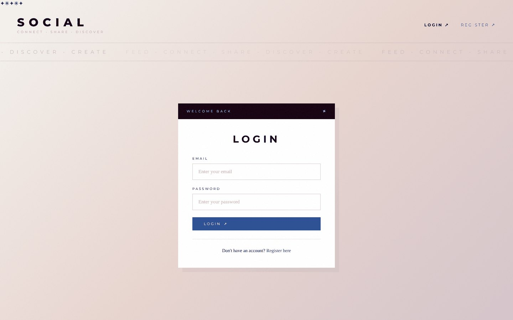
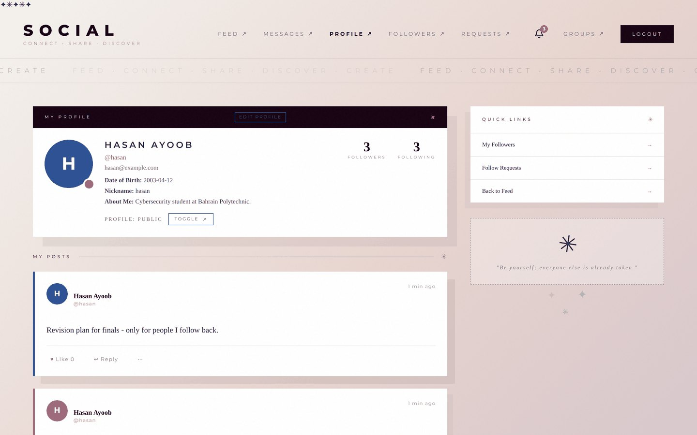
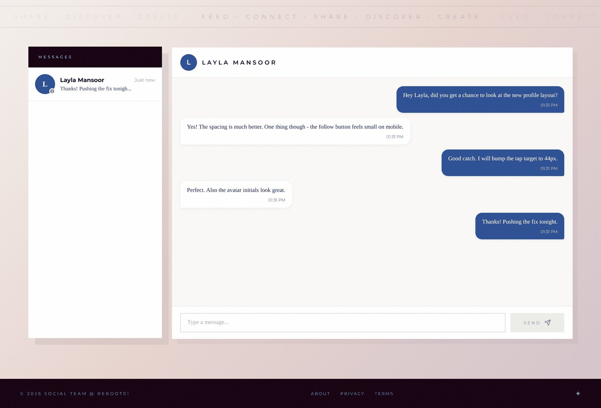

# Social Network

A full-stack social network: profiles with real privacy controls, a following model with
request approval, posts with per-post audiences, group spaces, and private messaging that
runs over WebSockets.

Built as the capstone project for the Reboot01 curriculum. The backend is Go with no web
framework — `net/http`, `database/sql` and SQLite — so the routing, session handling,
migrations and access control are all written out rather than delegated to a library.



---

## Contents

- [What it does](#what-it-does)
- [Stack](#stack)
- [Running it](#running-it)
- [Screenshots](#screenshots)
- [How it is put together](#how-it-is-put-together)
- [Privacy model](#privacy-model)
- [Tests](#tests)
- [API reference](#api-reference)
- [Configuration](#configuration)
- [Project layout](#project-layout)

---

## What it does

**Accounts and profiles.** Register with an email, password, date of birth and optional
avatar, nickname and bio. Passwords are hashed with bcrypt; sessions are server-side rows
keyed by a 256-bit random token in an `HttpOnly` cookie. A profile can be flipped between
public and private at any time.

**Following.** Following a public account takes effect immediately. Following a private
account creates a request the owner can accept or decline. Followers, following and
pending requests each have their own page, and the counts only ever reflect accepted
relationships.

**Posts with three audiences.** Every post picks who can see it:

| Audience | Who sees it |
| --- | --- |
| `public` | Anyone, as long as the author's profile is public |
| `almost-private` | The author's accepted followers |
| `private` | Only the specific people the author names when posting |

Posts can carry an image, and anyone who can see a post can like and comment on it. The
feed is assembled per viewer from these rules rather than filtered in the browser.

**Groups.** Create a group, invite people, or request to join one. Members get a shared
post wall with comments, a group chat, and events — each event has a going / not going
response that other members can see.

**Private messaging.** One-to-one chat over a WebSocket connection, with typing
indicators, read receipts, an online-user list, and notifications when a message arrives
while you are elsewhere in the app. Messaging is limited to people you actually have a
relationship with, and that limit is enforced on the server for both the REST endpoint and
the socket.

**Notifications.** A bell in the navigation collects follow requests, accepted follows,
new messages, group invitations and event announcements, with unread counts and a
mark-all-read action.

---

## Stack

**Backend**

| | |
| --- | --- |
| Language | Go 1.23 |
| HTTP | `net/http` + `http.ServeMux` — no framework |
| Database | SQLite via `mattn/go-sqlite3`, plain `database/sql` |
| Migrations | Numbered `.sql` files applied at startup |
| Auth | bcrypt (`golang.org/x/crypto`) + server-side sessions |
| Realtime | `gorilla/websocket` with a hub goroutine |

**Frontend**

| | |
| --- | --- |
| Framework | React 19 |
| Build | Vite 7 |
| Routing | React Router 7 |
| Icons | lucide-react |
| State | React context (`useAuth`, `WebSocketContext`) |
| Styling | Hand-written CSS |

**Deployment** — two Docker images (Go binary, and the built frontend behind nginx),
wired together with Docker Compose.

---

## Running it

### With Docker Compose

```bash
docker compose up --build
```

Then open <http://localhost>. nginx serves the built frontend and proxies `/api`, `/ws`
and `/uploads` to the Go service. The database lives on a named volume, so it survives
`docker compose down`.

### Locally, for development

You need Go 1.23+ and Node 20+.

**Backend** — from `backend/`:

```bash
go mod download
go run ./cmd/main.go
```

It listens on `:8080`, creates `social.db` next to itself on first run, and applies every
migration in `internal/db/migrations` in filename order.

**Frontend** — from `frontend/`, in a second terminal:

```bash
npm install
npm run dev
```

Vite serves <http://localhost:5173> and proxies API calls to the backend on `:8080`.

Register two accounts in separate browser profiles to see following, messaging and
notifications work against each other.

### Tests

From `backend/`:

```bash
go test ./...            # run everything
go test ./... -v         # per-test output
go test ./... -cover     # with coverage
```

---

## Screenshots

| | |
| --- | --- |
|  |  |
| **Login** — session cookie is set here | **Profile** — privacy toggle and your own posts |



*Private messages delivered over a WebSocket, with the conversation list showing unread counts.*

---

## How it is put together

A request arrives at `ServeMux`, which is wrapped in two layers:

```
request → CORSMiddleware → AuthMiddleware → ServeMux → handler
```

`AuthMiddleware` reads the `session_id` cookie, resolves it to a user, and attaches that
user to the request context. It never rejects a request itself — an invalid or expired
session simply means the request continues as anonymous, and each handler decides whether
that is acceptable. `CurrentUser(ctx)` is how handlers ask who is calling.

The code is layered so that SQL stays out of the handlers:

- **`internal/app`** — HTTP handlers, middleware, the WebSocket hub, password hashing and
  the session lifecycle.
- **`internal/db`** — every query lives here, one file per area (`postdb.go`,
  `followdb.go`, `groupdb.go`…), plus migrations.
- **`internal/models`** — the structs that move between the two.

The WebSocket hub keeps a map of connected clients keyed by user ID and owns it through a
single goroutine, so registration, delivery and the online-user broadcast never race. Each
connection gets a read pump and a write pump, with ping/pong keepalives and a bounded send
buffer.

---

## Privacy model

Visibility is the part of this project with the most edge cases, so it is worth stating
plainly. A post is visible to a viewer when any of the following is true:

1. The viewer is the author.
2. The post is `public` **and** the author's profile is public.
3. The viewer is an accepted follower **and** the post is `public` or `almost-private`.
4. The post is `private` **and** the viewer is on that post's allow-list.

The feed and profile queries build that rule into their `WHERE` clauses. `db.CanViewPost`
states the same rule for a single post, and the per-post endpoints call it. This matters
because `/api/posts/{id}/comments` and `/api/posts/{id}/like` accept any post ID: if they
trusted the feed to have filtered already, they would be a way to read and write on posts
that were never shared with you. `TestCanViewPostRules` pins the whole table down.

Profile privacy composes with it. A private profile shows only name, avatar and counts to
someone who does not follow it — no posts, no email, no date of birth. Those two fields
are never returned for *any* account other than your own.

Messaging follows the same principle. The UI only offers a chat box for people you are
mutual follows with, but that is a browser-side decision, so `db.CanMessage` re-checks it
on the server for both the REST endpoint and the WebSocket path.

---

## Tests

The backend has **71 tests** covering authentication, the follow lifecycle, post
visibility and messaging permissions.

```
$ go test ./... -v
...
ok      social-network/internal/app     17.0s
```

Each test builds a real server against a throwaway SQLite database seeded by the actual
migrations, and talks to it over HTTP with a cookie jar — the same way the frontend does.
There are no mocks, so a broken migration or a bad query fails the suite.

| File | Covers |
| --- | --- |
| `auth_test.go` | bcrypt hashing and salting, registration validation, login, session issue / expiry / logout, and that no endpoint ever returns a password hash |
| `follow_test.go` | public vs. private follows, accept and decline, acting on someone else's request, count accuracy, mutual-friend detection |
| `postaccess_test.go` | the visibility table above, applied to reading comments, writing comments and liking |
| `regression_test.go` | specific bugs that were fixed, so they cannot come back: see below |
| `testing_test.go` | shared harness — server, database, registered users with live sessions |

The regression tests correspond to defects found and fixed while auditing this project:

- `POST /api/posts` returned 500 for every post because a query selected seven columns and
  scanned into eight — while the row had already been committed.
- The same column mismatch broke both profile post listings, so no one could see the posts
  on any profile page.
- Comments and likes had no visibility check, so any account could read and write on any
  post, including private ones and post IDs that did not exist.
- SQLite was running without `foreign_keys` enabled, which made every `ON DELETE CASCADE`
  in the migrations inert and allowed orphaned rows.
- Registration returned `"id": 0` because the generated row ID was discarded.
- Uploads accepted any file extension, and are served from the app's own origin.

---

## API reference

All endpoints return JSON. Authentication is the `session_id` cookie; `401` means no valid
session. Endpoints that take a post, user or group ID return `404` when the caller is not
allowed to see it, rather than `403`, so IDs cannot be probed.

<details>
<summary><strong>Auth &amp; profile</strong></summary>

| Method | Path | Purpose |
| --- | --- | --- |
| `POST` | `/api/register` | Create an account (JSON or multipart with an avatar) |
| `POST` | `/api/login` | Start a session |
| `POST` | `/api/logout` | End the session |
| `GET` | `/api/me` | The signed-in user |
| `PUT` | `/api/me` | Update profile fields and avatar |
| `POST` | `/api/me/privacy` | Toggle public / private |
| `GET` | `/api/users/{id}` | Another profile, filtered by what you may see |
| `GET` | `/api/users/search?q=` | Search by name or nickname |
| `GET` | `/api/users/suggestions` | People you do not follow yet |

</details>

<details>
<summary><strong>Following</strong></summary>

| Method | Path | Purpose |
| --- | --- | --- |
| `POST` | `/api/users/{id}/follow` | Follow, or send a request to a private account |
| `POST` | `/api/users/{id}/unfollow` | Unfollow |
| `GET` | `/api/me/followers` | Accepted followers |
| `GET` | `/api/me/following` | Accounts you follow |
| `GET` | `/api/me/follow-requests` | Pending requests addressed to you |
| `GET` | `/api/me/follow-counts` | Follower and following counts |
| `POST` | `/api/follow-requests/{id}/accept` | Accept a pending request |
| `POST` | `/api/follow-requests/{id}/decline` | Decline it |
| `GET` | `/api/me/friends` | Mutual follows, used by messaging |
| `GET` | `/api/check-mutual?user_id=` | Whether you and a user follow each other |

</details>

<details>
<summary><strong>Posts</strong></summary>

| Method | Path | Purpose |
| --- | --- | --- |
| `POST` | `/api/posts` | Create a post (JSON, or multipart with an image) |
| `GET` | `/api/feed` | Feed assembled for the viewer |
| `GET` | `/api/me/posts` | Your own posts |
| `GET` | `/api/posts/{id}/comments` | Comments, if you may see the post |
| `POST` | `/api/posts/{id}/comments` | Add a comment |
| `POST` | `/api/posts/{id}/like` | Toggle your like |

</details>

<details>
<summary><strong>Messages &amp; notifications</strong></summary>

| Method | Path | Purpose |
| --- | --- | --- |
| `GET` | `/api/messages` | Conversation list with unread counts |
| `GET` | `/api/messages/{userID}` | One conversation, paginated |
| `POST` | `/api/messages/{userID}` | Send a message |
| `GET` | `/api/messages/unread-count` | Total unread |
| `GET` | `/api/notifications` | Your notifications |
| `POST` | `/api/notifications/{id}/read` | Mark one read |
| `POST` | `/api/notifications/read-all` | Mark all read |
| `GET` | `/api/notifications/unread-count` | Unread count |
| `WS` | `/ws` | Chat, typing indicators, read receipts, presence |

</details>

<details>
<summary><strong>Groups &amp; events</strong></summary>

| Method | Path | Purpose |
| --- | --- | --- |
| `GET` `POST` | `/api/groups` | List or create groups |
| `GET` | `/api/groups/{id}` | Group detail |
| `POST` | `/api/groups/{id}/join` | Join, or request to join |
| `POST` | `/api/groups/{id}/leave` | Leave |
| `POST` | `/api/groups/{id}/invite` | Invite someone |
| `GET` | `/api/groups/{id}/members` | Members |
| `POST` | `/api/groups/{id}/remove` | Remove a member |
| `GET` `POST` | `/api/groups/{id}/posts` | Group wall |
| `GET` `POST` | `/api/groups/{id}/events` | Events in the group |
| `POST` | `/api/groups/{id}/events/{eventID}/respond` | Going / not going |
| `GET` | `/api/groups/{id}/events/{eventID}/responses` | Who responded |
| `GET` `POST` | `/api/groups/{id}/messages` | Group chat history |
| `GET` | `/api/groups/invitations` | Invitations you have received |
| `POST` | `/api/groups/invitations/{id}/accept` | Accept |
| `POST` | `/api/groups/invitations/{id}/decline` | Decline |

</details>

---

## Configuration

The backend reads these environment variables; every one has a working default, so it runs
with no configuration at all.

| Variable | Default | Purpose |
| --- | --- | --- |
| `DB_PATH` | `social.db` | Where the SQLite file lives. Point it at a mounted volume in Docker |
| `PORT` | `8080` | Listen port |
| `MIGRATIONS_PATH` | `internal/db/migrations` | Where to find the `.sql` migrations |
| `ALLOWED_ORIGINS` | `http://localhost:5173,http://127.0.0.1:5173` | Comma-separated browser origins allowed to call the API with credentials and open a WebSocket |

The frontend reads `VITE_API_URL`. Leave it empty in production — nginx proxies `/api`,
`/ws` and `/uploads`, so relative URLs are correct. See `frontend/.env.example`.

---

## Project layout

```
backend/
  cmd/main.go                 entry point: config, migrations, server
  internal/
    app/
      server.go               routes, CORS
      middleware.go           session → request context
      auth.go                 register, login, sessions
      password.go             bcrypt helpers
      handlers.go             profile, posts, comments, likes
      followhandlers.go       follow lifecycle
      messagehandlers.go      private messages
      grouphandlers.go        groups, members, group posts
      eventhandlers.go        group events and responses
      notificationhandlers.go notifications
      websocket.go            hub, client pumps, chat
      *_test.go               the test suite
    db/
      db.go                   connection, migration runner
      migrations/             001…015, applied in order
      *db.go                  queries, one file per area
    models/                   shared structs
  uploads/                    avatars and post images (not in git)

frontend/
  src/
    api/                      one module per endpoint group
    components/               PostCard, FollowButton, GroupChat, …
    pages/                    one per route
    hooks/useAuth.js          session state
    WebSocketContext.jsx      socket connection and dispatch
  nginx.conf                  SPA routing + API/WS/uploads proxy

docs/screenshots/             images used by this README
docker-compose.yml
```

---

## Known gaps

Honest list of what is not done:

- No refresh-token rotation; sessions are fixed seven-day cookies.
- `Secure` is not set on the session cookie because the project is served over plain HTTP
  locally — it needs to be enabled behind TLS.
- No rate limiting on login or registration.
- Uploads are validated by extension, not by sniffing the file contents.
- The frontend has no automated tests.
- A handful of React hooks have dependency-array warnings (`npm run lint`), and the
  WebSocket reconnect path references its own callback before declaration.
